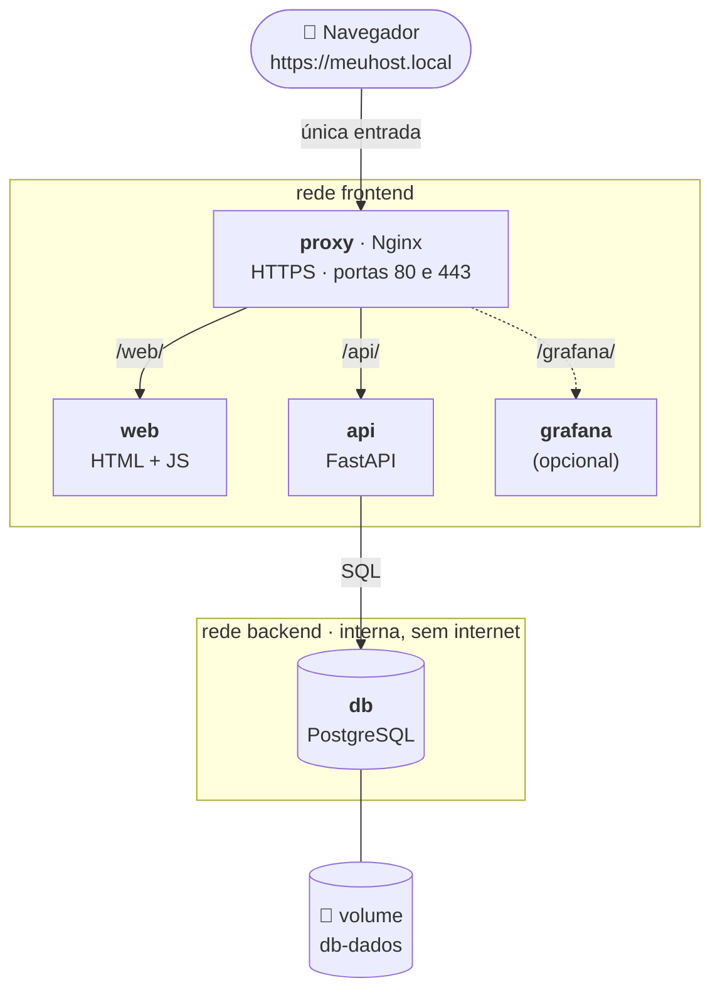
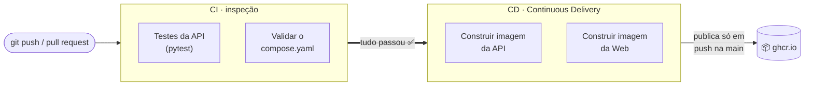

# 🐾 Cadastro de Pets

Sistema simples de cadastro de pets (**API + Web**), feito para praticar **empacotamento, publicação e operação** de aplicações em containers.

O foco não é a aplicação, e sim **como ela roda**: imagens versionadas, orquestração, proxy reverso com HTTPS, healthchecks, secrets, logs organizados, monitoramento e CI/CD.

[](https://github.com/Guuusta/cadastro-pets/actions/workflows/ci-cd.yml)

---

## Sumário

- [Arquitetura](#arquitetura)
- [Tecnologias](#tecnologias)
- [Como subir o ambiente](#como-subir-o-ambiente)
- [Como usar](#como-usar)
- [Operação: saúde, logs e monitoramento](#operação-saúde-logs-e-monitoramento)
- [CI/CD e versionamento](#cicd-e-versionamento)
- [Decisões técnicas](#decisões-técnicas)
- [Estrutura do repositório](#estrutura-do-repositório)
- [Problemas comuns](#problemas-comuns)

---

## Arquitetura



| Serviço | Função | Exposto para fora? |
|---|---|---|
| `proxy` | Nginx: HTTPS e roteamento por caminho (`/web`, `/api`, `/grafana`) | ✅ portas 80 e 443 |
| `web` | Interface (HTML/JS) servida por Nginx sem root | ❌ só via proxy |
| `api` | API REST (CRUD de pets) em Python/FastAPI | ❌ só via proxy |
| `db` | PostgreSQL com volume persistente | ❌ só a API alcança |

**Monitoramento (opcional, `--profile monitoramento`):** Prometheus (métricas), Loki (logs), Alloy (coleta de logs) e Grafana (painéis).

---

## Tecnologias

| Camada | Tecnologia | Versão |
|---|---|---|
| API | Python + FastAPI + SQLAlchemy | 3.12 / 0.142 / 2.1 |
| Web | HTML + JavaScript puro, servido por `nginx-unprivileged` | 1.30.5 |
| Banco | PostgreSQL | 18.6 |
| Proxy | Nginx | 1.30.5 |
| Orquestração | Docker Compose | v2 |
| CI/CD | GitHub Actions + GitHub Container Registry (ghcr.io) | — |
| Monitoramento | Prometheus · Loki · Alloy · Grafana | 3.15 · 3.7 · 1.20 · 13.2 |

---

## Como subir o ambiente

### Pré-requisitos

- **Docker** com o plugin **Docker Compose v2** (`docker compose version`)
- **Linux ou macOS** (no Windows, use o WSL2)
- *(opcional, recomendado)* **[mkcert](https://github.com/FiloSottile/mkcert)**, para um certificado HTTPS confiável (sem aviso no navegador)

### Passo a passo

**1. Baixe o projeto**

```bash
git clone https://github.com/Guuusta/cadastro-pets.git
cd cadastro-pets
```

**2. Crie a configuração** a partir do modelo (os valores padrão já funcionam):

```bash
cp .env.example .env
```

**3. Crie os secrets** (senhas em arquivo, fora do Git):

```bash
mkdir -p secrets && chmod 700 secrets
printf '%s' 'escolha-uma-senha-do-banco' > secrets/db_password.txt
chmod 600 secrets/db_password.txt

# Só se for usar o monitoramento (o Grafana roda como outro usuário e precisa ler o arquivo):
printf '%s' 'escolha-uma-senha-do-grafana' > secrets/grafana_admin_password.txt
chmod 644 secrets/grafana_admin_password.txt
```

**4. Gere o certificado HTTPS** (usa o mkcert se estiver instalado; senão, cria um autoassinado):

```bash
# com mkcert, rode uma vez antes: mkcert -install
./scripts/gerar-certificado.sh
```

**5. Aponte o nome `meuhost.local` para a sua máquina:**

```bash
echo "127.0.0.1 meuhost.local" | sudo tee -a /etc/hosts
```

**6. Suba o ambiente.** Escolha **uma** das opções:

```bash
# A) Usando as imagens já publicadas pelo CI no GitHub (mais rápido)
docker compose pull
docker compose up -d --wait

# B) Construindo as imagens na sua máquina
docker compose up -d --build --wait
```

O `--wait` só devolve o terminal quando todos os serviços estiverem **saudáveis** (healthy).

**7. Pronto!** Confira:

```bash
docker compose ps
```

### Subir com monitoramento

```bash
docker compose --profile monitoramento up -d --wait
```

### Parar

```bash
docker compose --profile monitoramento down     # para tudo; os dados ficam nos volumes
docker compose --profile monitoramento down -v  # ⚠️ para e APAGA os dados (volumes)
```

---

## Como usar

| O quê | Endereço |
|---|---|
| 🖥️ Interface web | https://meuhost.local/web |
| 📖 Documentação da API (Swagger) | https://meuhost.local/api/docs |
| ❤️ Saúde da API | https://meuhost.local/api/health |
| 📊 Grafana *(com monitoramento)* | https://meuhost.local/grafana (usuário `admin`) |

**Rotas da API** (todas atrás de `/api`):

| Método | Rota | Ação |
|---|---|---|
| `GET` | `/pets` | Listar pets |
| `GET` | `/pets/{id}` | Ver um pet |
| `POST` | `/pets` | Cadastrar |
| `PUT` | `/pets/{id}` | Editar |
| `DELETE` | `/pets/{id}` | Excluir |
| `GET` | `/health` | Saúde (inclui o banco) |

Exemplo:

```bash
curl -X POST https://meuhost.local/api/pets \
  -H "Content-Type: application/json" \
  -d '{"nome": "Rex", "especie": "Cachorro", "raca": "Vira-lata", "idade": 3, "tutor": "Ana"}'
```

> Se o certificado for autoassinado (sem mkcert), adicione `-k` ao `curl`.

---

## Operação: saúde, logs e monitoramento

### Saúde (healthchecks)

Todos os serviços têm healthcheck, e a ordem de subida respeita a saúde (`depends_on: condition: service_healthy`):

```
db + web  →  api (espera o banco)  →  proxy (espera api e web)
```

O `/health` da API faz um `SELECT 1` no banco: sem banco, responde **503** e o container fica `unhealthy`.

### Logs

Todos os serviços escrevem **uma linha JSON por evento** no stdout, com `hora`, `servico` e um **`request_id`**. O proxy gera esse id e o repassa (`X-Request-ID`), então é possível seguir um pedido do proxy até a API:

```bash
docker compose logs -f api                       # acompanhar ao vivo
docker compose logs --no-log-prefix proxy api | grep <request_id>   # seguir um pedido
docker compose logs --no-log-prefix proxy | grep '^{' | jq 'select(.status >= 400)'   # só erros
```

A rotação é feita pelo Docker: no máximo **3 arquivos de 10 MB** por container.

### Monitoramento (`--profile monitoramento`)

- **Prometheus** coleta as métricas da API em `/metrics` (pedidos, erros, latência p95 e operações com pets). Esse caminho **não** é exposto pelo proxy.
- **Alloy** recolhe os logs de todos os containers do projeto e envia ao **Loki** (retenção de 7 dias).
- **Grafana** sobe com as fontes de dados e o painel **"Cadastro de Pets"** já provisionados.

---

## CI/CD e versionamento

O workflow [`.github/workflows/ci-cd.yml`](.github/workflows/ci-cd.yml) roda a cada push e pull request:



- A publicação **só acontece se os testes passarem**, e só em push na `main` (em pull request, as imagens são apenas construídas, para provar que o build funciona).
- É **Continuous Delivery**: o pipeline entrega a imagem pronta no registry. A implantação (`docker compose pull` + `up`) é feita por uma pessoa; automatizar esse passo seria **Continuous Deployment**.
- Cada imagem recebe 3 tags: a **versão** (ex.: `0.5.0`), o **commit** (`sha-<hash>`) e `latest`.
- **Versionamento semântico, por aplicação:** a versão oficial de cada imagem fica no `.env.example` (`API_VERSION`, `WEB_VERSION`). Conserto sobe o PATCH (`0.1.0 → 0.1.1`), funcionalidade nova sobe o MINOR (`0.1.1 → 0.2.0`).
- Commits seguem o padrão [Conventional Commits](https://www.conventionalcommits.org/pt-br/) (`feat:`, `fix:`, `ci:`, `chore:`...).

---

## Decisões técnicas

| Decisão | Motivo |
|---|---|
| **Web chama a API por `/api` (mesmo host)** | Evita CORS; o proxy decide o destino de cada caminho. |
| **Só o proxy tem porta aberta** | API, Web e banco não ficam acessíveis diretamente de fora. |
| **Redes `frontend` e `backend` (interna)** | O banco só é alcançável pela API (menor privilégio); a rede do banco não tem saída para a internet. |
| **Senhas como Docker secrets** | Não aparecem no `docker inspect`, como aconteceria com variáveis de ambiente; só os serviços que precisam recebem. |
| **API recebe usuário/senha do banco separados** | Senhas com `@`, `:` ou `/` quebravam a URL de conexão (bug real, corrigido na v0.1.1 e coberto por teste). |
| **Containers sem root** | A API roda como `appuser` e a Web usa `nginx-unprivileged`: uma invasão não vira "dono" do container. |
| **Versões fixas em todas as imagens** | Nada de `latest` nas imagens de terceiros: o ambiente não muda sozinho. |
| **Healthcheck da API testa o banco** | "Estar vivo" não basta: a API só está saudável se consegue trabalhar. |
| **Logs JSON com `request_id`** | Fáceis de filtrar (`jq`, Loki) e de correlacionar entre proxy e API. |
| **HTTPS com redirecionamento** | Todo acesso HTTP vira HTTPS (TLS 1.2/1.3, HTTP/2). Localmente com mkcert; em produção seria Let's Encrypt. |
| **Monitoramento em `profile`** | O sistema principal fica leve; o monitoramento liga quando necessário. |
| **Proxy resolve o Grafana na hora do pedido** | Com o monitoramento desligado, só `/grafana` falha (502); o resto continua no ar. |

**Pontos de atenção conhecidos:**
- O Alloy monta o `docker.sock` (somente leitura) para ler os logs. O socket do Docker é sensível, por isso o Alloy não tem porta exposta e fica numa rede interna.
- A API roda com um único processo do Uvicorn; para produção, seriam várias réplicas atrás do proxy (ou Kubernetes).

---

## Estrutura do repositório

```
cadastro-pets/
├── api/                      # API (FastAPI)
│   ├── app/                  #   código: rotas, banco, validação, logs, métricas
│   ├── tests/                #   testes automáticos (pytest)
│   └── Dockerfile
├── web/                      # Interface web
│   ├── public/               #   index.html, app.js, style.css
│   ├── nginx.conf
│   └── Dockerfile
├── proxy/
│   └── nginx.conf            # proxy reverso: HTTPS, /web, /api, /grafana
├── monitoramento/            # Prometheus, Loki, Alloy e Grafana (configs e painel)
├── scripts/
│   └── gerar-certificado.sh  # certificado HTTPS (mkcert ou openssl)
├── .github/workflows/
│   └── ci-cd.yml             # pipeline: testes → build → publicação
├── compose.yaml              # orquestração de tudo
├── .env.example              # modelo de configuração (copiar para .env)
└── secrets/                  # senhas (criado por você; fora do Git)
```

---

## Problemas comuns

| Sintoma | Causa provável | Solução |
|---|---|---|
| `port is already allocated` ao subir | Portas 80/443 em uso na sua máquina | Mude `PROXY_PORT` e `PROXY_HTTPS_PORT` no `.env` e acesse `https://meuhost.local:<porta>/web` |
| `meuhost.local` não abre | Nome não está no `/etc/hosts` | Refaça o passo 5 |
| Navegador avisa "não seguro" | Certificado autoassinado (sem mkcert) | Instale o mkcert, rode `mkcert -install` e gere o certificado de novo; reinicie o navegador |
| Mudei o `proxy/nginx.conf` e nada mudou | O Nginx lê o arquivo só ao ligar | `docker compose exec proxy nginx -t && docker compose exec proxy nginx -s reload` |
| API `unhealthy` | Banco fora do ar ou senha errada | `docker compose logs api` e confira `secrets/db_password.txt` |
| `/grafana` retorna 502 | Monitoramento desligado | `docker compose --profile monitoramento up -d --wait` |
| Login do Grafana recusado | O Grafana não conseguiu ler o secret na 1ª subida e ficou com a senha padrão | `chmod 644 secrets/grafana_admin_password.txt` e redefina: `docker compose --profile monitoramento exec grafana grafana cli admin reset-admin-password "$(cat secrets/grafana_admin_password.txt)"` |
